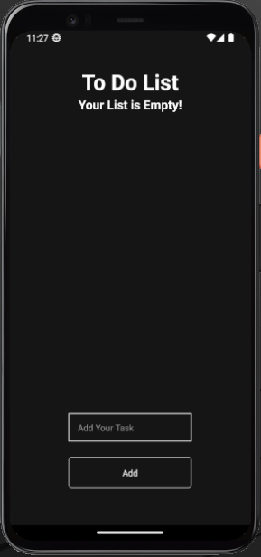

# Boas vindas ao repositório do projeto ToDoList--React-Native-Expo!

Este projeto foi desenvolvido por mim no aprendizado de aplicaçõe mobile.

Esta projeto é uma aplicação para treinar os conceitos de web para mobile, com criação de componentes remoção deles e utilização de state do React.

Essa aplicação foi feita em React Native com Expo que é um frame work que abstrai o React Native, proporcionando uma criação mais rapida de API's, além de proporcinar ótimas opções para desenvolvimento.

**A aplicação**
A aplicação se desenrola toda no front-end, a estilização da pagina é usando a StyleSheet do React Native e os componentes foram pensados para formato de telas mobile. 

A aplicação inicia com a <strong>Tela Incial</strong> com o aviso de que sua lista está vazia.
    

O usuario poderá então digitar uma task na caixa de TextInput, caso esteja abrindo a aplicação em mobile irá aparecer o teclado virtual do aparelho que não ficará sobre os componentes da aplicação.
    

Ao apertar no Add, o teclado será fechado e a task será salva no state "Data" do React.
    

Quando terminar a sua task poderá selecionar para ficar verde e clicar no icone de lixeira para deletar caso queria tirar da lista
    

# Orientações de INSTALAÇÃO DO PROJETO

  1. Clone o repositório
  - Entre na pasta que deseja instalar no terminal.
  - Use o comando: `git clone git@github.com:th-maia/ToDoList--React-Native-Expo.git`.
  - Entre na pasta do repositório que você acabou de clonar:
    - `cd ToDoList--React-Native-Expo`

  2. Instale as dependências

  - Para isso, use o seguinte comando: `npm install`, 
      caso dê algum erro tente rodar novamente o comando acima, pode ocorrer por diferentes versões ou pacotes que foram instalados após outros.
  
  3. Rode o comando para iniciar a aplicação: `npm start`.
    

   - Se quiser rodar no browser do seu computador aperte `w`
   - Se quiser rodar no seu celular Android instale a aplicação no `Expo Go` na Store do seu celular e escanei o QR code. 
    
<strong>OBS:caso aconteça algum erro instale o expo no seu computador com o comando `npm install -g expo-cli`, para ver se instalou corretamente aperte `expo --version`, use o `expo start` ao invés do `npm start`.</strong>

   4. para fechar a aplicação aperte ctrl+C no terminal. 
